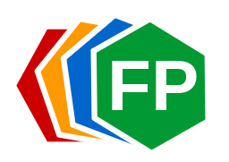

# FastenerPattern

**FastenerPattern** is a solution for designing fastener patterns (i.e. *bolted* and *riveted* joints) in Aerostructures, for Windows, Mac OS X and Linux.

Its core is developed in C++, based on the [Qt framework](https://www.qt.io/ "Qt framework"). It uses the [Boost::Units](http://www.boost.org/ "Boost") module.

## CP solver

Optionaly, FastenerPattern can use a third-party CP solver called CPFP (*Constraint Programming Solver for FastenerPattern*). 

More info [here](cpsolver/README.txt "here").

## Installation

Download the most recent package from the [download](https://github.com/setvisible/fastenerpattern/releases "Last Releases") page, unzip it and run it.

Read the [User's Manual](user-manual/User_Manual.pdf "User_Manual.pdf").

## Build

1. Download `FastenerPattern.tar.gz` [here](https://github.com/setvisible/fastenerpattern/releases "Last Releases").

2. Unzip:

        $ tar zxvf FastenerPattern.tar.gz
        $ cd pch2csv/

3. Build with CMake

     - On Unix / Mac OS X

            $ mkdir -p build
            $ cd build/
            $ cmake ..
            $ make -j
            $ make install

     - On Windows (MinGW)

            > mkdir build
            > cd build/
            > cmake .. -G "MinGW Makefiles"
            > make -j
            > make install

       (the last command could require admin rights)

     - On Windows (MSVC)

            > mkdir build
            > cd build/
            > cmake .. -G "Visual Studio 14 2015"
            > start .

         Then, double click the Visual Studio project (vcxproj).

## License

The code is released under the GNU **LGPLv3** open source license.

[https://www.gnu.org/licenses/lgpl-3.0.en.html](https://www.gnu.org/licenses/lgpl-3.0.en.html)
